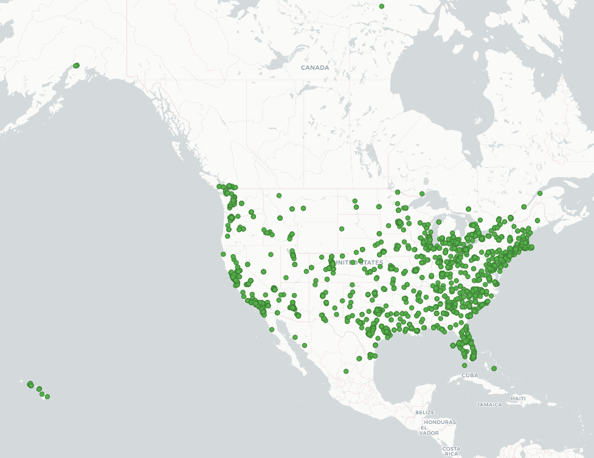
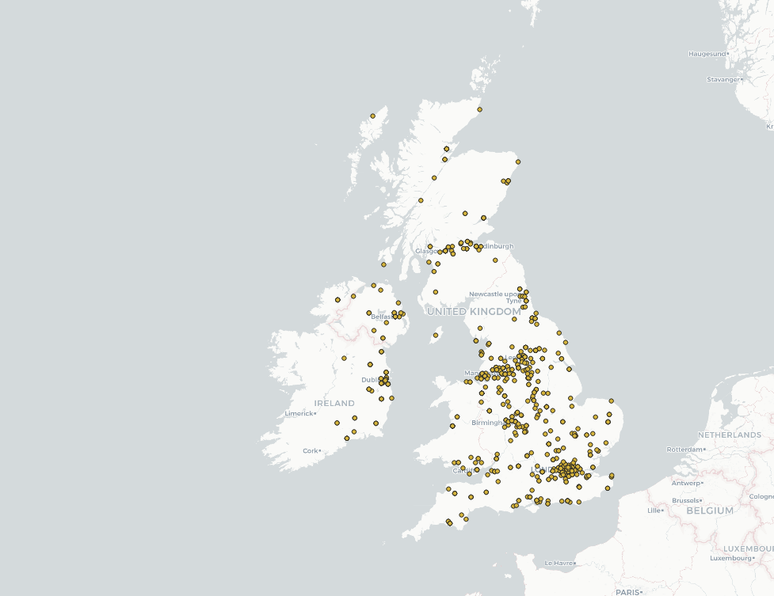
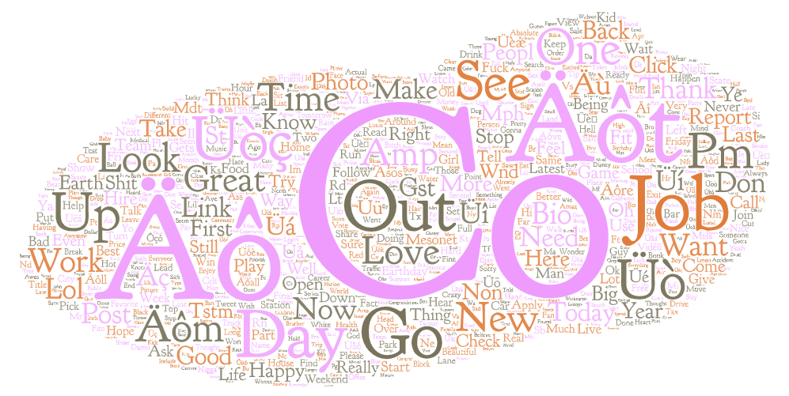
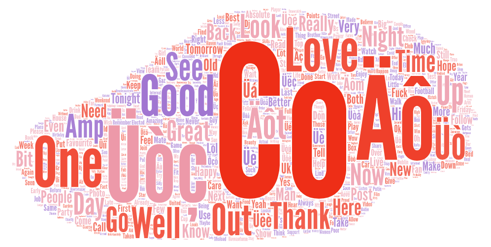

# GEOG548 - Lab2

## Comparison
Through this lab, I ran the tweet-collection program in the United States (including Hawaii and Alaska) and the United Kingdom. I chose both of those location because they are predominantly english-speaking countries, so it would be interesting to see the most commonly used phrases, slang, and expressions in those places.

## Maps

Given the time that the program was ran (approx. 2:30-3:00 PM PT) there were overall more tweets tweeted in the United States than in the United Kingdom. Within th US, the east coast tweeted more frequently than the west coast. Both those occurances could be due to the fact that the given time frame corresponds to 10:30-11 AM in the UK (when many people were not awake or too busy to tweet because of work and morning obligations) and 5:30-6 PM ET (when many people have just gotten off work). 

## Word Cloud

Aside from the the phonetic phrases that pop up in both word clouds (ex. Co, Äôt, Äô), the words most commonly tweeted in the United States around 2:30-3:00 PM PT were "Day", "Job", "Go", "Time", "Out", etc. Those words make sense in the context of the east coast being the most frequent tweeters during a time where people typically clock out of their jobs, especially on a Friday. 

The words that pop up in the United Kingdom word cloud were "Love", "Good", "Thank", "Well", etc. Those words might be the product of people tweeting phrases like "Good Morning" or other morning messages since the program was ran around 10:30-11 AM in the UK.